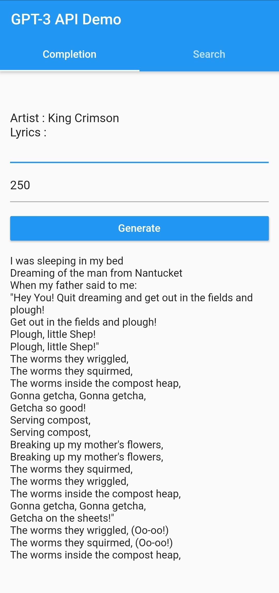
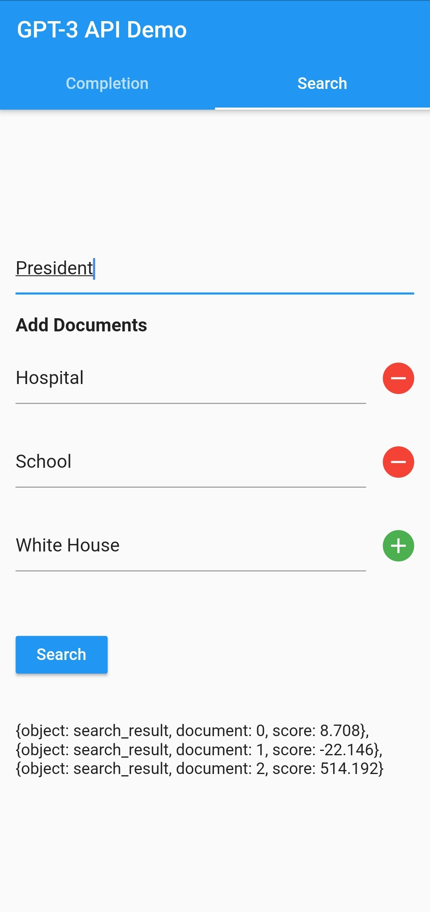

# GPT-3 Dart

A simple Dart package to use with OpenAI's GPT-3 API.

## Installation

```yaml
dependencies:
  flutter:
    sdk: flutter
  gpt_3_dart:
```

## Usage

```dart
import 'package:gpt_3_dart/gpt_3_dart.dart';

void main() async {
  OpenAI openAI = new OpenAI(apiKey: "API_KEY_HERE");

  // generate summary of a Wikipedia article
  String summary_prompt = "Summarize this for a toddler:\n\n";
  String wikipedia_article = "WIKIPEDIA_ARTICLE_HERE";
  String summary = await openAI.complete(summary_prompt + wikipedia_article, 200, engine: "text-davinci-002", temperature: 0.7, topP: 1.0, frequencyPenalty: 0, presencePenalty: 0);
  print(summary);

  // generate questions from summary
  String question_generation_prompt = "Generate questions given this paragraph:\n\n";
  String questions = await openAI.complete(question_generation_prompt + summary, 200, engine: "text-davinci-002", temperature: 0.7, topP: 1.0, frequencyPenalty: 0, presencePenalty: 0);
  print(questions);
}
```

## Examples

### Fiction Book

```dart
String postProcess(String text) {
  RegExp sentenceRe = RegExp(r"(?<!\w\.\w.)(?<![A-Z][a-z]\.)(?<=\.|\?)\s");

  // if string doesn't end with period
  if (!text.endsWith(".") && !text.endsWith("?") && !text.endsWith("!")) {
    // drop last sentence
    List sentences = text.split(sentenceRe);
    return sentences.sublist(0, sentences.length-1).join(" ");
  } else {
    return text;
  }
}

void main() async {
  OpenAI openAI = new OpenAI(apiKey: "API_KEY_HERE");

  // generate summary of a fiction book
  String fiction_summary_prompt = "\n\nTl;dr:";
  String fiction_book = "FICTION BOOK HERE";
  String summary = await openAI.complete(fiction_book + fiction_summary_prompt, 60, engine: "text-davinci-002", temperature: 0.7, topP: 1.0, frequencyPenalty: 0, presencePenalty: 0);
  String processedSummary = postProcess(summary);

  // generate cliff-hanging question from summary
  String fiction_question_prompt = "\n\nGenerate a cliff-hanger question from the text:";
  String question = await openAI.complete(processedSummary + fiction_question_prompt, 60, engine: "text-davinci-002", temperature: 0.7, topP: 1.0, frequencyPenalty: 0, presencePenalty: 0);

  // final summary output for fiction book
  String outputSummary = processedSummary.replaceAll("\n", "") + " " + question.replaceAll("\n", "");
  print(outputSummary);
}
```

### Non-fiction Book

```dart
void main() async {
  OpenAI openAI = new OpenAI(apiKey: "API_KEY_HERE");

  // generate summary of a non-fiction book
  String non_fiction_summary_prompt = "\n\nWe learned about";
  String non_fiction_book = "NON-FICTION BOOK HERE";
  String summary = await openAI.complete(non_fiction_book + non_fiction_summary_prompt, 60, engine: "text-davinci-002", temperature: 0.0, topP: 1.0, frequencyPenalty: 0, presencePenalty: 0);
  String processedSummary = postProcess(summary);

  // final summary output for non-fiction book
  String outputSummary = non_fiction_summary_prompt.replaceAll("\n", "") + processedSummary.replaceAll("\n", "");
  print(outputSummary);
}
```

## Example App

|     Text Completion     |    Semantic Search    |
| :---------------------: | :-------------------: |
|  |  |
